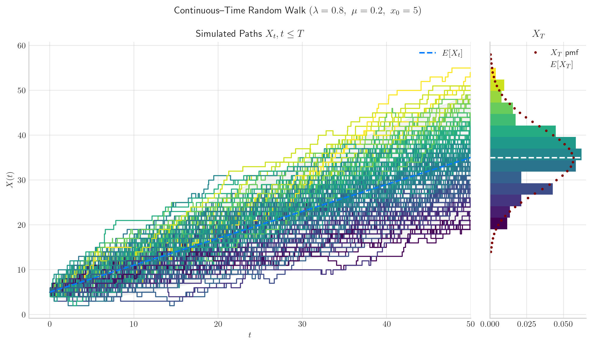
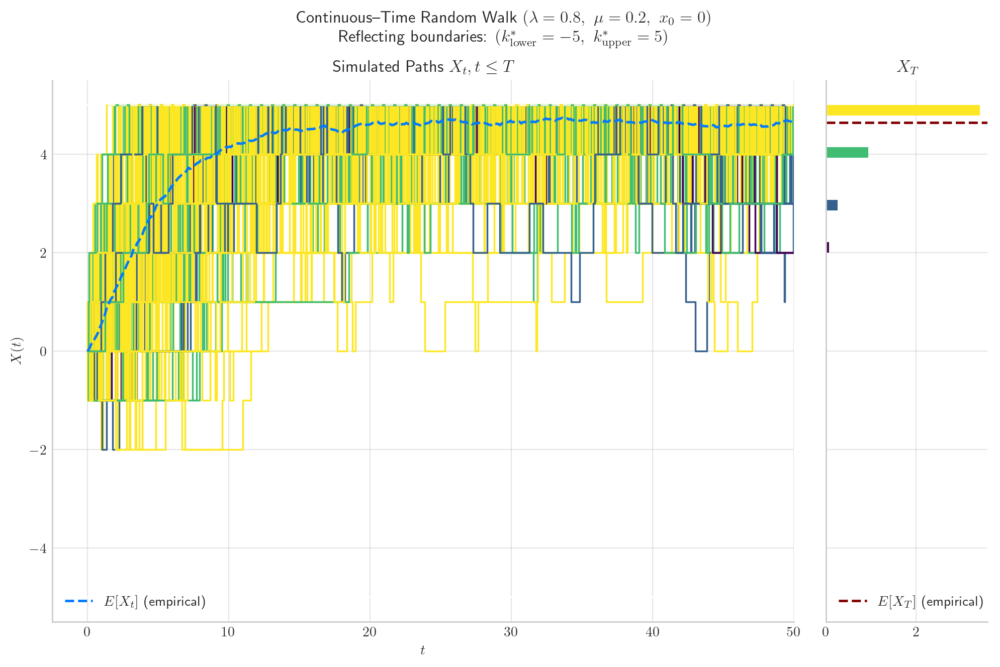

# *aleatory*

[](https://pypi.org/project/aleatory/) [](https://pepy.tech/project/aleatory)
 [](https://aleatory.readthedocs.io/en/latest/?badge=latest)

- [Git Homepage](https://github.com/quantgirluk/aleatory)
- [Pip Repository](https://pypi.org/project/aleatory/)
- [Documentation](https://aleatory.readthedocs.io/en/latest/)
- 🆕 [Gallery of Stochastic Processes](https://aleatory.readthedocs.io/en/latest/auto_examples/index.html) 🖼️

-----

## Implemented in this fork


### 1. `processes.jump.ContinuousTimeRandomWalk`

This class implements a nearest-neighbour continuous-time jump process on the full integer lattice $\mathbb{Z}$. The process jumps upward with rate $\lambda$ and downward with rate $\mu$, so it supports both symmetric and biased walks. For constant left and right jump rates, the marginal law at fixed time is given by the Skellam distribution.

<p align="center">
  
</p>

**Signature**

```python
from aleatory.processes import ContinuousTimeRandomWalk

ContinuousTimeRandomWalk(
    rate_up=0.5,
    rate_down=0.5,
    initial=0,
    rng=None,
)
```

**Arguments**

- `rate_up`: right-jump rate $\lambda \geq 0$
- `rate_down`: left-jump rate $\mu \geq 0$
- `initial`: initial state $x_0 \in \mathbb{Z}$
- `rng`: optional NumPy random number generator

At least one of `rate_up` or `rate_down` must be positive.

**Implemented core methods**

- `sample(T=...)`  
  simulate a single path up to time `T`

- `simulate(N=..., T=...)`  
  simulate `N` independent paths up to time `T`

- `get_marginal(t)`  
  return the exact marginal law at time `t` as a SciPy Skellam random variable

- `marginal_expectation(times)`  
  return the exact mean function

- `marginal_variance(times)`  
  return the exact variance function

- `plot(...)`  
  produce a basic path plot

- `draw(...)`  
  produce an ensemble figure with simulated paths, terminal histogram, exact marginal overlay, and mean behaviour

**Implementation notes**

- paths are represented as `(times, states)` pairs
- the waiting time between jumps is exponential with parameter $\lambda + \mu$
- at each jump, the process moves by exactly $+1$ or $-1$
- for constant rates, the process can be represented as the difference of two independent Poisson processes
- the fixed-time marginal law is implemented via `scipy.stats.skellam`


### 2. `processes.jump.ReflectingContinuousTimeRandomWalk`

This class implements a nearest-neighbour continuous-time jump process on an integer state space with one-sided or two-sided reflecting boundaries. In the interior, the process jumps upward with rate $\lambda$ and downward with rate $\mu$. At a reflecting boundary, any jump that would leave the admissible state space is suppressed by setting the outward jump rate to zero.

<p align="center">
  
</p>

**Signature**

```python
from aleatory.processes import ReflectingContinuousTimeRandomWalk

ReflectingContinuousTimeRandomWalk(
    rate_up=0.5,
    rate_down=0.5,
    initial=0,
    lower=None,
    upper=None,
    rng=None,
)
```

**Arguments**

- `rate_up`: right-jump rate $\lambda \geq 0$
- `rate_down`: left-jump rate $\mu \geq 0$
- `initial`: initial state $x_0 \in \mathbb{Z}$
- `lower`: optional lower reflecting boundary
- `upper`: optional upper reflecting boundary
- `rng`: optional NumPy random number generator

At least one of `lower` or `upper` must be specified. If both are specified, the class requires `lower < upper`, and the initial state must lie inside the admissible state space.

**Implemented core methods**

- `sample(T=...)`  
  simulate a single path up to time `T`

- `simulate(N=..., T=...)`  
  simulate `N` independent paths up to time `T`

- `plot(...)`  
  produce a basic path plot

- `draw(...)`  
  produce an ensemble figure using empirical summaries from simulated paths, including terminal histograms and empirical mean behaviour

**Implementation notes**

- paths are represented as `(times, states)` pairs
- reflection is implemented through state-dependent local rates
- at a lower reflecting boundary, the downward jump rate is set to zero
- at an upper reflecting boundary, the upward jump rate is set to zero


### Tests

1. `ReflectingContinuousTimeRandomWalk`

```text
tests/test_reflecting_cont_time_random_walk.py
```

Covers:

- constructor validation
- path structure invariants
- state-space invariants
- reflection-rule checks
- trapping edge cases
- comparison with the unbounded walk in a wide interval
- basic long-time bounded behaviour checks

Run it from the repository root with:

```bash
python -m unittest discover -s tests -p "test_reflecting_cont_time_random_walk.py"
```

----

## Overview

The **_aleatory_** (/ˈeɪliətəri/) Python library provides functionality for simulating and visualising
stochastic processes. More precisely, it introduces objects representing a number of 
stochastic processes and provides methods to:

- generate realizations/trajectories from each process —over discrete time sets
- create visualisations to illustrate the processes properties and behaviour


<p align="center">

</p>

Currently, aleatory supports the following stochastic processes in one dimension:

- Arithmetic Brownian Motion (see [Brownian Motion](https://aleatory.readthedocs.io/en/latest/processes/aleatory.processes.BrownianMotion.html#aleatory.processes.BrownianMotion))
- [Bessel process](https://aleatory.readthedocs.io/en/latest/processes/aleatory.processes.BESProcess.html#aleatory.processes.BESProcess)
- [Brownian Bridge](https://aleatory.readthedocs.io/en/latest/processes/aleatory.processes.BrownianBridge.html#aleatory.processes.BrownianBridge)
- [Brownian Excursion](https://aleatory.readthedocs.io/en/latest/processes/aleatory.processes.BrownianExcursion.html#aleatory.processes.BrownianExcursion)
- [Brownian Meander](https://aleatory.readthedocs.io/en/latest/processes/aleatory.processes.BrownianMeander.html#aleatory.processes.BrownianMeander)
- [Brownian Motion](https://aleatory.readthedocs.io/en/latest/processes/aleatory.processes.BrownianMotion.html#aleatory.processes.BrownianMotion)
- [Constant Elasticity Variance (CEV) process](https://aleatory.readthedocs.io/en/latest/processes/aleatory.processes.CEVProcess.html#aleatory.processes.CEVProcess)
- [Cox–Ingersoll–Ross (CIR) process](https://aleatory.readthedocs.io/en/latest/processes/aleatory.processes.CIRProcess.html#aleatory.processes.CIRProcess)
- [Chan-Karolyi-Longstaff-Sanders (CKLS) process](https://aleatory.readthedocs.io/en/latest/processes/aleatory.processes.CKLSProcess.html#aleatory.processes.CKLSProcess)
- [Fractional Brownian Motion process](https://aleatory.readthedocs.io/en/latest/processes/aleatory.processes.fBM.html#aleatory.processes.fBM)
- [Galton-Watson process with Poisson branching](https://aleatory.readthedocs.io/en/latest/processes/aleatory.processes.GaltonWatson.html#aleatory.processes.GaltonWatson)
- [Gamma process](https://aleatory.readthedocs.io/en/latest/processes/aleatory.processes.GammaProcess.html#aleatory.processes.GammaProcess)
- [General Random Walk](https://aleatory.readthedocs.io/en/latest/processes/aleatory.processes.GeneralRandomWalk.html#aleatory.processes.GeneralRandomWalk)
- [Geometric Brownian Motion](https://aleatory.readthedocs.io/en/latest/processes/aleatory.processes.GBM.html#aleatory.processes.GBM)
- [Hawkes process](https://aleatory.readthedocs.io/en/latest/processes/aleatory.processes.HawkesProcess.html#aleatory.processes.HawkesProcess)
- [Inverse Gaussian process](https://aleatory.readthedocs.io/en/latest/processes/aleatory.processes.InverseGaussian.html#aleatory.processes.InverseGaussian)
- [Inhomogeneous Poisson process](https://aleatory.readthedocs.io/en/latest/processes/aleatory.processes.InhomogeneousPoissonProcess.html#aleatory.processes.InhomogeneousPoissonProcess)
- [Mixed Poisson process](https://aleatory.readthedocs.io/en/latest/processes/aleatory.processes.MixedPoissonProcess.html#aleatory.processes.MixedPoissonProcess)
- [Ornstein–Uhlenbeck (OU) process](https://aleatory.readthedocs.io/en/latest/processes/aleatory.processes.OUProcess.html#aleatory.processes.OUProcess)
- [Poisson process](https://aleatory.readthedocs.io/en/latest/processes/aleatory.processes.PoissonProcess.html#aleatory.processes.PoissonProcess)
- [Random Walk](https://aleatory.readthedocs.io/en/latest/processes/aleatory.processes.RandomWalk.html#aleatory.processes.RandomWalk)
- [Squared Bessel processes](https://aleatory.readthedocs.io/en/latest/processes/aleatory.processes.BESQProcess.html#aleatory.processes.BESQProcess)
- [Vasicek process](https://aleatory.readthedocs.io/en/latest/processes/aleatory.processes.Vasicek.html#aleatory.processes.Vasicek)
- [Variance-Gamma process](https://aleatory.readthedocs.io/en/latest/processes/aleatory.processes.VarianceGammaProcess.html#aleatory.processes.VarianceGammaProcess)

From v1.1.1 aleatory supports the following 2-d stochastic processes:

- [Brownian Motion 2D](https://aleatory.readthedocs.io/en/latest/auto_examples/plot_brownian_2d.html#sphx-glr-auto-examples-plot-brownian-2d-py)
- [Correlated Brownian Motions](https://aleatory.readthedocs.io/en/latest/auto_examples/plot_correlated_bms.html)
- [Random Walk 2D](https://aleatory.readthedocs.io/en/latest/auto_examples/plot_random_walk_2d.html#sphx-glr-auto-examples-plot-random-walk-2d-py)

## Installation

Aleatory is available on [pypi](https://pypi.python.org/pypi) and can be
installed as follows

```
pip install aleatory
```

## Dependencies

Aleatory relies heavily on

- ``numpy``  for random number generation
- ``scipy`` and ``statsmodels`` for support for a number of one-dimensional distributions.
- ``matplotlib`` for creating visualisations

## Compatibility

Aleatory is tested on Python versions 3.8, 3.9, 3.10, and 3.11

## Quick-Start

Aleatory allows you to create fancy visualisations from different stochastic processes in an easy and concise way.

For example, the following code

```python
from aleatory.processes import BrownianMotion

brownian = BrownianMotion()
brownian.draw(n=100, N=100, colormap="cool", figsize=(12,9))

```

generates a chart like this:

<p align="center">

</p>

For more examples visit the [Quick-Start Guide](https://aleatory.readthedocs.io/en/latest/general.html).


**If you like this project, please give it a star!** ⭐️

## Thanks for Visiting! ✨

Connect with me via:

- 🦜 [Twitter](https://twitter.com/Quant_Girl)
- 👩🏽‍💼 [Linkedin](https://www.linkedin.com/in/dialidsantiago/)
- 📸 [Instagram](https://www.instagram.com/quant_girl/)
- 👾 [Personal Website](https://quantgirl.blog)


